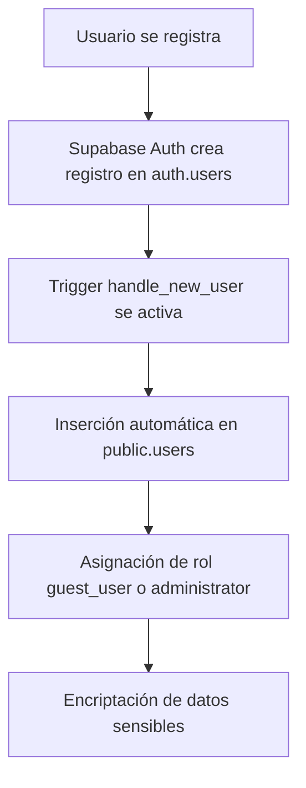

# 🔄 Flujo Completo de Onboarding de Usuario - Frontend & Backend

## 🎯 Objetivo
Documentación integral del proceso de onboarding de usuarios, desde el registro hasta la configuración de terminal, integrando tanto la perspectiva del **backend (PostgreSQL/Supabase)** como del **frontend (Flutter)**.

## 📊 Resumen Ejecutivo
- **Flujo completo**: Registro → Perfil → Terminal Setup → Operación
- **Arquitectura multi-tenant**: Cada usuario pertenece a una terminal
- **Integración Frontend-Backend**: Flutter + Supabase + PostgreSQL

---

## 🏗️ Arquitectura Integral

### Backend Stack (Supabase/PostgreSQL)
```
├── Auth Layer
│   ├── auth.users - Autenticación Supabase
│   └── public.users - Perfiles de usuario
├── Business Logic
│   ├── terminals - Configuración de clínicas/centros
│   ├── user_terminal_roles - Roles por terminal
│   └── administrative_units - Localización geográfica
├── Functions & Triggers
│   ├── handle_new_user - Sincronización auth → public
│   ├── create_terminal() - Creación de terminal
│   ├── get_user_profile_with_terminals() - Estado del usuario
│   └── soft_delete_generic() - Eliminación segura
└── Edge Functions
    ├── get-dropdown-data - Datos geográficos en cascada
    └── create-terminal - API de creación
```

### Frontend Stack (Flutter)
```
├── Screens
│   ├── LoginScreen - Autenticación
│   ├── TerminalSetupScreen - Configuración inicial
│   └── HomeScreen - Dashboard principal
├── State Management
│   ├── AuthProvider - Estado de autenticación
│   └── StreamBuilder - Navegación reactiva
├── Services
│   └── HTTP Client - Comunicación con Edge Functions
└── Navigation Flow
    └── Conditional Routing - Basado en estado del usuario
```

---

## 🔄 Flujo Completo Paso a Paso

### **FASE 1: Registro de Usuario** 🔐

#### **Backend Process:**


**1. Registro en `auth.users`:**
- Usuario completa formulario de registro.
- Supabase Auth valida y crea cuenta.

**2. Trigger `handle_new_user`:**
```sql
-- Disparado automáticamente
CREATE TRIGGER handle_new_user 
    AFTER INSERT ON auth.users 
    FOR EACH ROW EXECUTE FUNCTION handle_new_user();
```

**3. Creación en `public.users`:**
- Sincronización automática de datos.
- Rol por defecto: `guest_user` (o `administrator` para primer usuario).
- Encriptación de `first_name` y `last_name`.


---

### **FASE 2: Verificación de Estado del Usuario** 🔍

#### **Backend Process:**
**Función `get_user_profile_with_terminals()`:**
```sql
CREATE OR REPLACE FUNCTION get_user_profile_with_terminals(p_user_id UUID)
RETURNS JSON
```

**Lógica de verificación:**
- ✅ Usuario existe en `public.users`.
- ✅ Usuario tiene terminal asignada.


---

### **FASE 3: Configuración de Terminal** 🏥


#### **Backend Process - Edge Functions:**

**1. Edge Function `get-dropdown-data`:**
```typescript
// Manejo de datos geográficos en cascada
const DATA_TYPES = {
  COUNTRIES: 'countries',
  PROVINCES: 'provinces', 
  MUNICIPALITIES: 'municipalities',
  LOCAL_UNITS: 'local_units'
};
```

**2. Terminal Creation Process:**
```typescript
// Edge Function create-terminal
const { data, error } = await supabase.rpc('create_terminal', {
  p_name: terminal_name,
  p_administrative_unit_id: administrative_unit_id
});
```

**3. Función SQL `create_terminal()`:**
```sql
-- Creación de terminal + asignación de rol automática
CREATE OR REPLACE FUNCTION create_terminal(p_name text, p_administrative_unit_id uuid)
RETURNS UUID
```

---

### **FASE 4: Navegación Automática Post-Setup** ✅

#### **Frontend Process:**
- Después de crear la terminal, se actualiza el perfil del usuario.
- El `StreamBuilder` en `main.dart` detecta el cambio en el estado de autenticación y navega automáticamente a la `HomeScreen`.

---

## 🔄 Ciclo de Vida y Soft Delete

### **Eliminación Suave (Soft Delete)**
```sql
-- Trigger que intercepta DELETE
CREATE TRIGGER soft_del_users 
    BEFORE DELETE ON public.users 
    FOR EACH ROW EXECUTE FUNCTION soft_delete_generic();

-- En lugar de borrar, marca como eliminado
UPDATE users SET 
    is_deleted = true,
    deleted_at = NOW(),
    deleted_by = current_user_id
WHERE id = target_user_id;
```

### **Limpieza Automática Programada**
```sql
-- Job diario que elimina registros > 30 días
SELECT cron.schedule('daily-user-purge-job', '0 4 * * *', $$ SELECT public.hard_delete_all_older_than('30 days'::interval); $$);
```

---

## 📊 Diagrama de Flujo Completo

```mermaid
graph TD
    A[👤 Usuario se registra] --> B[🔐 Supabase Auth crea auth.users]
    B -->|Trigger| C[📝 handle_new_user crea public.users]
    C --> D[📱 Flutter verifica estado]
    D --> E{¿Tiene terminal?}
    E -->|❌ No| F[🏥 Terminal Setup Screen]
    E -->|✅ Sí| G[🏠 Home Screen]
    
    F --> H[🌍 Carga países via get-dropdown-data]
    H --> I[📍 Usuario selecciona ubicación]
    I --> J[📝 Usuario llena formulario]
    J --> K[🚀 POST a create-terminal edge function]
    K --> L[⚙️ create_terminal() SQL function]
    L --> M[🏥 Crea terminal + asigna rol admin]
    M --> N[🔄 refreshUserProfile()]
    N --> O[✅ StreamBuilder detecta cambio]
    O --> G[🏠 Navegación automática a Home]
    
    G --> P{Usuario solicita eliminación}
    P -->|Soft Delete| Q[🗑️ Marca is_deleted=true]
    P -->|Dashboard Delete| R[💥 CASCADE DELETE]
    Q -->|30 días después| S[🧹 Hard delete automático]
```
